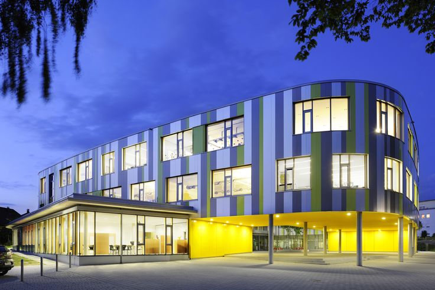
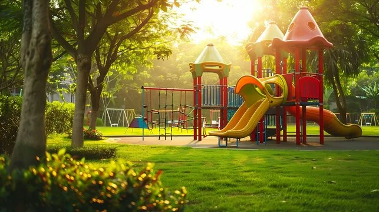

<!DOCTYPE html>
<html lang="ru">
<head>
    <meta charset="UTF-8">
    <meta name="viewport" content="width=device-width, initial-scale=1.0">
    <title>🧸 Бюджетный детский сад</title>
    
    <!-- Шрифт Montserrat -->
    <link href="https://fonts.googleapis.com/css2?family=Montserrat:wght@400;500;600;700&display=swap" rel="stylesheet">
    
    <!-- Bootstrap 5 CSS -->
    <link href="https://cdn.jsdelivr.net/npm/bootstrap@5.3.2/dist/css/bootstrap.min.css" rel="stylesheet">
    <!-- Bootstrap Icons -->
    <link href="https://cdn.jsdelivr.net/npm/bootstrap-icons@1.11.1/font/bootstrap-icons.css" rel="stylesheet">
    
    
</head>
<body class="bg-light">

    <!-- Навигация -->
    <nav class="navbar navbar-expand-lg navbar-dark bg-primary sticky-top shadow-sm">
        

            <a class="navbar-brand fw-bold" href="#">
                <i class="bi bi-piggy-bank-fill me-2"></i>Бюджетный детский сад
            </a>
            <button class="navbar-toggler" type="button" data-bs-toggle="collapse" data-bs-target="#navbarNav">
                
            </button>
            

                <ul class="navbar-nav me-auto">
                    <li class="nav-item"><a class="nav-link active" href="#">🏠 Главная</a></li>
                    <li class="nav-item"><a class="nav-link" href="#spending">💰 Куда идут деньги</a></li>
                    <li class="nav-item"><a class="nav-link" href="#about">❓ Как это работает</a></li>
                </ul>
                

                    Собрано налогов:
                    0 ₽
                

            

        

    </nav>

    <!-- Герой-секция с каруселью -->
    

        

            

                

                    

                        <button type="button" data-bs-target="#heroCarousel" data-bs-slide-to="0" class="active"></button>
                        <button type="button" data-bs-target="#heroCarousel" data-bs-slide-to="1"></button>
                        <button type="button" data-bs-target="#heroCarousel" data-bs-slide-to="2"></button>
                    

                    

                        

                            

                                <h1 class="display-5 fw-bold">🎪 Добро пожаловать!</h1>
                                
Узнай, как налоги превращаются в детские сады, школы и парки!

                                <button class="btn btn-light btn-lg fw-bold" data-bs-toggle="modal" data-bs-target="#howItWorks">
                                    <i class="bi bi-play-circle me-2"></i>Как это работает?
                                </button>
                            

                        

                        

                            

                                <h1 class="display-5 fw-bold">👾 Познакомься с Бюджетиком!</h1>
                                
Он любит "кушать" налоги и "выплевывать" бюджет на добрые дела!

                                👾
                            

                        

                        

                            

                                <h1 class="display-5 fw-bold">🎯 Твоя миссия</h1>
                                
Покорми Бюджетика налогами — и он построит новую площадку!

                                <button class="btn btn-light btn-lg fw-bold" onclick="feedMonster()">
                                    <i class="bi bi-currency-ruble me-2"></i>Покормить монстра!
                                </button>
                            

                        

                    

                    <button class="carousel-control-prev" type="button" data-bs-target="#heroCarousel" data-bs-slide="prev">
                        
                    </button>
                    <button class="carousel-control-next" type="button" data-bs-target="#heroCarousel" data-bs-slide="next">
                        
                    </button>
                

            

        

    

    <!-- Основной контент с карточками -->
    

        

            

                <h2 class="fw-bold text-primary">🎁 На что пошли наши деньги?</h2>
                
Нажми на карточку, чтобы узнать подробности!

            

        

        

            <!-- Карточка 1: Школа -->
            

                

                    
                    

                        <h5 class="card-title fw-bold text-primary">🏫 Новая школа</h5>
                        
Современные классы, компьютеры и спортзал для детей!

                        

                            
75%

                        

                        <button class="btn btn-outline-primary w-100" data-bs-toggle="modal" data-bs-target="#schoolModal">
                            <i class="bi bi-info-circle me-1"></i>Подробнее
                        </button>
                    

                    

                        <small class="text-muted"><i class="bi bi-check-circle-fill text-success me-1"></i>Финансируется из бюджета</small>
                    

                

            

            <!-- Карточка 2: Больница -->
            

                

                    
                    

                        <h5 class="card-title fw-bold text-danger">🏥 Детская поликлиника</h5>
                        
Бесплатные врачи, прививки и современное оборудование.

                        

                            
90%

                        

                        <button class="btn btn-outline-danger w-100" data-bs-toggle="modal" data-bs-target="#hospitalModal">
                            <i class="bi bi-info-circle me-1"></i>Подробнее
                        </button>
                    

                    

                        <small class="text-muted"><i class="bi bi-check-circle-fill text-success me-1"></i>Финансируется из бюджета</small>
                    

                

            

            <!-- Карточка 3: Парк ✅ ИСПРАВЛЕНО -->
            

                

                    
                    

                        <h5 class="card-title fw-bold text-success">🌳 Парк с площадкой</h5>
                        <!-- 🔧 Исправлено: был пропущен открывающий тег 
 -->
                        
Безопасные горки, качели и зелёные зоны для прогулок.

                        

                            
60%

                        

                        <button class="btn btn-outline-success w-100" data-bs-toggle="modal" data-bs-target="#parkModal">
                            <i class="bi bi-info-circle me-1"></i>Подробнее
                        </button>
                    

                    

                        <small class="text-muted"><i class="bi bi-check-circle-fill text-success me-1"></i>Финансируется из бюджета</small>
                    

                

            

        

    

    <!-- Интерактивная зона с монстром -->
    

        

            

                
👾

                
Нажми на монстра, чтобы "покормить" его налогом!

                <button class="btn btn-warning btn-lg fw-bold shadow" onclick="feedMonster()">
                    <i class="bi bi-currency-ruble me-2"></i>Дать 100 ₽
                </button>
            

            

                <h4 class="fw-bold mb-3">📊 Визуализация бюджета</h4>
                
                

                    

                        🏫 Школы
                        45%
                    

                    

                        

                    

                

                
                

                    

                        🏥 Медицина
                        30%
                    

                    

                        

                    

                

                
                

                    

                        🌳 Парки и спорт
                        15%
                    

                    

                        

                    

                

                
                

                    

                        🔧 Прочее
                        10%
                    

                    

                        

                    

                

                
                

                    <i class="bi bi-lightbulb me-2"></i>
                    <strong>Знаешь ли ты?</strong> Каждый рубль налогов возвращается тебе в виде бесплатных услуг!
                

            

        

    

    <!-- Модальные окна -->
    
    <!-- Модальное окно: Как это работает -->
    

        

            

                

                    <h5 class="modal-title">🔄 Как работает бюджет?</h5>
                    <button type="button" class="btn-close btn-close-white" data-bs-dismiss="modal"></button>
                

                

                    <ol class="list-group list-group-flush">
                        <li class="list-group-item">👨‍👩‍👧‍👦 Люди платят налоги государству</li>
                        <li class="list-group-item">👾 Бюджетик "съедает" налоги</li>
                        <li class="list-group-item">💰 Деньги идут в бюджет</li>
                        <li class="list-group-item">🏫🏥🌳 Бюджет строит школы, больницы, парки</li>
                        <li class="list-group-item">😊 Все довольны!</li>
                    </ol>
                

                

                    <button type="button" class="btn btn-primary" data-bs-dismiss="modal">Понял! 🎉</button>
                

            

        

    

    <!-- Модальное окно: Школа -->
    

        

            

                

                    <h5 class="modal-title">🏫 Новая школа</h5>
                    <button type="button" class="btn-close" data-bs-dismiss="modal"></button>
                

                

                    
                    
На строительство этой школы было выделено <strong>150 млн ₽</strong> из бюджета.

                    <ul>
                        <li>25 современных классов</li>
                        <li>Компьютерная лаборатория</li>
                        <li>Спортивный зал и стадион</li>
                        <li>Бесплатное питание для учеников</li>
                    </ul>
                

                

                    <button type="button" class="btn btn-secondary" data-bs-dismiss="modal">Закрыть</button>
                    <button type="button" class="btn btn-primary">🎒 Хочу учиться здесь!</button>
                

            

        

    

    <!-- Модальное окно: Больница -->
    

        

            

                

                    <h5 class="modal-title">🏥 Детская поликлиника</h5>
                    <button type="button" class="btn-close" data-bs-dismiss="modal"></button>
                

                

                    
                    
Бюджет выделил <strong>80 млн ₽</strong> на современное оборудование.

                    <ul>
                        <li>Бесплатный приём педиатра</li>
                        <li>Вакцинация по календарю прививок</li>
                        <li>Новое диагностическое оборудование</li>
                        <li>Комфортные палаты для малышей</li>
                    </ul>
                

                

                    <button type="button" class="btn btn-secondary" data-bs-dismiss="modal">Закрыть</button>
                    <button type="button" class="btn btn-danger">❤️ Спасибо врачам!</button>
                

            

        

    

    <!-- Модальное окно: Парк -->
    

        

            

                

                    <h5 class="modal-title">🌳 Парк с площадкой</h5>
                    <button type="button" class="btn-close" data-bs-dismiss="modal"></button>
                

                

                    
                    
На благоустройство парка потрачено <strong>25 млн ₽</strong>.

                    <ul>
                        <li>Безопасные детские площадки</li>
                        <li>Зелёные зоны и скамейки</li>
                        <li>Освещение и видеонаблюдение</li>
                        <li>Бесплатный вход для всех!</li>
                    </ul>
                

                

                    <button type="button" class="btn btn-secondary" data-bs-dismiss="modal">Закрыть</button>
                    <button type="button" class="btn btn-success">🛝 Хочу на площадку!</button>
                

            

        

    

    <!-- Футер -->
    <footer class="bg-dark text-white py-4 mt-5">
        

            
🧸 Бюджетный детский сад — учимся понимать бюджет с детства!

            

                Источники данных: 
                <a href="https://budget.gov.ru" class="text-white-50 text-decoration-none" target="_blank">budget.gov.ru</a> | 
                <a href="https://minfin.gov.ru" class="text-white-50 text-decoration-none" target="_blank">minfin.gov.ru</a>
            

            <small class="text-muted">© 2024 Практическая работа по Bootstrap 5</small>
        

    </footer>

    <!-- Bootstrap JS Bundle -->
    
    
    <!-- Интерактив: звуки и анимация -->
    
</body>
</html>
